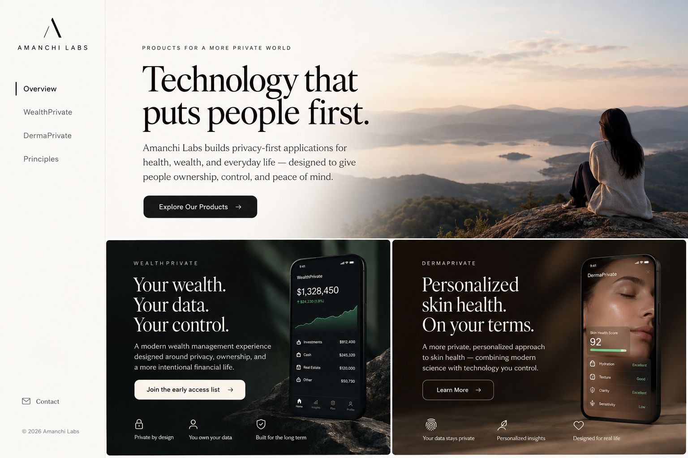

# Amanchi Labs Site Redesign — Design Spec
**Date:** 2026-10-08 (revised 2026-10-09)  
**Status:** Approved for implementation planning  
**Project:** amanchilabs.com — full visual and structural redesign

---

## Visual Reference

The image below is a **conceptual exploration only** — not an approved implementation design. The product screens and figures shown are illustrative and do not represent verified application functionality.



**What to take from this image:**
- Editorial sidebar treatment and typography quality ✅
- Left sidebar structure: brand mark + nav items + contact at bottom ✅
- Overview panel with two side-by-side product cards at bottom ✅
- Strong Instrument Serif display type + generous whitespace ✅

**What to discard:**
- Large scenic hero photography — replaced by editorial panel architecture ❌
- Fabricated financial figures ("$1,328,450") — must not appear in implementation ❌
- "Skin Health Score: 92" — fabricated health metric, not to be used ❌
- WealthPrivate "Join the early access list" if no actual waitlist exists ❌
- Any product status label ("Available Now", etc.) that misrepresents actual readiness ❌

---

## 1. Summary

Replace the current long-scroll marketing page with a premium, app-style experience:  
**fixed left sidebar + full-screen, viewport-contained right canvas panels**.

The site must feel like a world-class software studio — light editorial foundation with dark immersive product showcases — and answer three questions within five seconds per view: *What is this? Why should I care? What can I do next?*

**Guiding principle:** One screen. One clear message. One meaningful action.

---

## 2. Design Principles

| Principle | Directive |
|---|---|
| **One screen. One message. One action.** | Each panel is self-contained in a single viewport at standard desktop sizes. Scrolling is allowed as a graceful fallback on smaller screens and when browser zoom exceeds 100%, but should never be required on a ≥1280px viewport at 100% zoom. |
| **Light editorial + dark premium hybrid** | Warm off-white foundation. Product panels are dark and immersive. |
| **Typography-first** | Strong type hierarchy does the heavy lifting. Copy is minimal, confident, and specific. |
| **Honest representation** | No fabricated product data, financial figures, health scores, or performance claims. Conceptual UI mockups must be clearly labeled as illustrative. |
| **No generic SaaS** | No excessive gradients, stock photography, feature-grid lists, or marketing jargon. |
| **Earned trust** | Privacy, local-first, user ownership are woven into the experience — not added as a footnote. |

---

## 3. Layout Architecture

### Desktop (≥1024px)

```
┌─────────────────┬──────────────────────────────────────────────┐
│  LEFT SIDEBAR   │                                              │
│  220–240px      │         RIGHT CONTENT CANVAS                │
│  Fixed          │         (fills remaining viewport)          │
│  warm off-white │         Full-screen per section              │
│                 │                                              │
│  [AMANCHI LABS] │         Active panel renders here            │
│                 │         Smooth crossfade transition          │
│  — Overview     │         on nav switch                       │
│  — WealthPrivate│                                              │
│  — DermaPrivate │                                              │
│  — Principles   │                                              │
│                 │                                              │
│  — Contact ↓   │                                              │
└─────────────────┴──────────────────────────────────────────────┘
```

**Smaller laptop / zoom fallback:** On viewports between 768px–1280px, or when browser zoom causes content overflow, panels may scroll vertically within the canvas. Content must never clip or overflow hidden. The sidebar remains fixed; the canvas becomes scrollable.

### Mobile (< 768px)
- Left sidebar collapses into a top navigation bar.
- Compact product switcher or hamburger at top-right.
- Panels scroll vertically. No horizontal scroll ever.
- Touch-friendly tap targets (min 44px).

### Tablet (768px–1023px)
- Sidebar collapses to an icon-only rail (48px) or overlays on demand.
- Canvas fills remaining space. Vertical scroll permitted.

---

## 4. Left Sidebar Specification

**Width:** 220–240px (desktop)  
**Background:** Warm off-white (`#FAFAF8`)  
**Position:** Fixed, full viewport height  
**Right border:** Subtle 1px separator (`rgba(0,0,0,0.06)`)

### Anatomy (top → bottom)

1. **Studio Brand** — `AMANCHI LABS` wordmark + geometric mark. Generous top padding. Not a link (clicking logo navigates to Overview).
2. **Primary Navigation** — vertical stack with generous spacing and clear active-state indicator:
   - Overview
   - WealthPrivate
   - DermaPrivate
   - Principles
3. **Contact** — pinned near bottom with a subtle mail icon, discreet typographic treatment.
4. **Footer micro-copy** — `© 2026 Amanchi Labs` at very bottom in smallest possible weight.

### Active State
- Active item: charcoal text + 2px left accent bar (as shown in reference image).
- Inactive items: muted `#999`, no decoration.
- Hover: smooth opacity shift, 100ms.
- No heavy borders, chevrons, nested sub-menus, or badge counts.

### Typography (Sidebar)
- Studio name: geometric sans, `11–12px`, tracked uppercase, charcoal.
- Nav items: Inter, `14px`, medium weight for active, regular for inactive.

---

## 5. Navigation & Routing

| Concern | Solution |
|---|---|
| **URL state** | Hash routing: `/#overview`, `/#wealth`, `/#derma`, `/#principles`, `/#contact` |
| **Browser history** | `history.pushState` on panel switch — back/forward work naturally |
| **Direct links** | Sharing `/#wealth` opens directly to WealthPrivate panel |
| **Keyboard navigation** | Tab order: sidebar links → canvas content. Arrow keys cycle sidebar items. |
| **Transitions** | Crossfade (`opacity` 150–200ms ease-in-out). No sliding. No page reload. |
| **Accessibility** | `role="navigation"`, `aria-current="page"` on active item, `role="main"` on canvas, focus management on panel switch |
| **`prefers-reduced-motion`** | All transitions instantly resolved — panels appear without animation |

---

## 6. Panel Specifications

### 6.1 Overview Panel (Default / Home)

**URL:** `/#overview`  
**Background:** Warm off-white (continuous with sidebar)  
**Purpose:** Studio identity and product portfolio at a glance.

**Layout (two zones):**

**Top zone — Studio statement:**
- Eyebrow: `PRODUCTS FOR A MORE PRIVATE WORLD` (small, tracked uppercase, muted)
- **Headline (Instrument Serif, large):** `"Technology that puts people first."` — or similar owned studio voice
- **Body (2 sentences max):** `"Amanchi Labs builds thoughtful applications for health, wealth, and everyday life — designed to give people ownership, control, and peace of mind."`
- **Primary CTA:** `"Explore our products →"` — scrolls/focuses to the product cards below

**Bottom zone — Product cards (side by side):**

| WealthPrivate card | DermaPrivate card |
|---|---|
| Dark charcoal background | Warm ivory / muted sage background |
| Eyebrow: `WEALTHPRIVATE` (spaced uppercase) | Eyebrow: `DERMAPRIVATE` (spaced uppercase) |
| Headline: `"Your wealth. Your data. Your control."` | Headline: `"Personalized skincare. On your terms."` |
| 2-line descriptor | 2-line descriptor |
| CTA: see §6.2 | CTA: `"Learn more →"` |
| Conceptual UI mockup (right side of card) — **no fabricated financial figures** | Conceptual UI mockup (right side of card) — **no fabricated health scores** |
| 3 trust attributes at bottom: `Private by design · You own your data · Built for the long term` | 3 trust attributes at bottom: `Your data stays private · Personalized insights · Designed for real life` |

> **Important:** The reference image shows specific financial numbers and a health score. These must **not** appear in the implementation. Mockups must use abstract visualizations (line shapes, placeholders, generic UI chrome) clearly labeled "Illustrative."

---

### 6.2 WealthPrivate Panel

**URL:** `/#wealth`  
**Split-canvas layout:** Left ~40% copy / Right ~60% visual  
**Status label:** `IN DEVELOPMENT` (not "Available Now", not "Coming Soon" — honest, non-promissory)

**Left column — Copy:**
- Eyebrow: `WEALTHPRIVATE` (spaced uppercase, muted)
- **Status badge:** `IN DEVELOPMENT` (small, neutral)
- **Headline (Instrument Serif, 48–56px, white on dark left half):**  
  `"Your wealth.`  
  `Your data.`  
  `Your control."`
- **Value proposition (2 lines, 16px):**  
  `"Turn scattered financial documents into a private, source-backed history of your financial life — organized on your device."`
- **3 attribute chips:** `Local-first · Source-traced · Optional AI`
- **CTA:** `"Get in touch →"` → links to `founder@amanchilabs.com`  
  *(No "Join waitlist" unless a working waitlist exists. Email CTA is honest and direct.)*
- **Trust footnote:** `"WealthPrivate is designed so your financial data stays on your device. We do not store it."`

**Right column — Visual:**
- Full-height dark panel: deep charcoal `#141414`
- **Abstract conceptual mockup** of a financial dashboard: clean document list, a simplified timeline or graph shape (no specific dollar amounts), source-trace UI element
- Clearly labeled `"Illustrative — not a representation of released software"`
- Restrained slate/white accents — no gold, no green ticker effects

**Visual identity:**
- Deep charcoal + slate + white text
- Instrument Serif headlines, Inter body
- Tone: financial precision, privacy, intelligence, long-term trust

---

### 6.3 DermaPrivate Panel

**URL:** `/#derma`  
**Split-canvas layout:** Left ~40% copy / Right ~60% visual  
**Status label:** Use actual honest status — if publicly available, say so; if not, omit "Available Now"

**Left column — Copy:**
- Eyebrow: `DERMAPRIVATE` (spaced uppercase, muted)
- **Status badge:** Use actual current status (confirm before shipping)
- **Headline (Instrument Serif, 48–56px):**  
  `"Personalized`  
  `skincare.`  
  `On your terms."`
- **Value proposition (2 lines, 16px):**  
  `"Plan and understand your skincare routine with ingredient-aware intelligence. AI may assist — you decide what to keep."`
- **3 attribute chips:** `Routine planning · Ingredient-aware · Optional AI`
- **CTA:** `"Explore DermaPrivate →"` (links to `dermaprivate-website.onrender.com`)
- **Trust footnote:** `"Core planning is local-first. AI is optional and user-initiated."`

**Right column — Visual:**
- Full-height warm panel: warm ivory `#F5F0E8` transitioning to muted sage
- Elevated phone mockup (built from existing `RoutinePhone` component, redesigned to match editorial quality)
- Use actual product UI where available; label any additional illustrative screens clearly
- Warm sage and cream tones, soft natural feel

**Visual identity:**
- Warm ivory + muted sage + charcoal text
- Tone: calm, personal, thoughtful, trustworthy

---

### 6.4 Principles Panel

**URL:** `/#principles`  
**Background:** Warm off-white  
**Purpose:** Studio philosophy — what Amanchi Labs believes about software.

**Layout:** Editorial. No panel-level scroll required on ≥1280px at 100% zoom.

- **Headline (Instrument Serif):** `"Technology should work for you."`
- **4 principles in a 2×2 grid or clean vertical list:**

| # | Title | Body |
|---|---|---|
| 01 | Private by design | Privacy belongs in the architecture from the first sketch, not in a policy paragraph at the end. |
| 02 | Intelligent by choice | AI should improve understanding and reduce effort — visible, optional, and never quietly in charge. |
| 03 | You stay in control | A suggestion is a starting point. People decide what to save, change, or leave behind. |
| 04 | Made for real life | Focused tools for ordinary moments — carefully made, useful, and easy to understand. |

- **Studio footnote:** `"Amanchi Labs builds software for the most personal parts of life — where trust is earned, not assumed."`

---

### 6.5 Contact Panel

**URL:** `/#contact`  
**Background:** Deep charcoal `#141414`  
**Purpose:** Direct, human, confident. No form. No friction.

**Layout:**
- **Headline (Instrument Serif, large, white):** `"Let's build something useful."`
- **Supporting copy:** `"Thoughtful questions, product feedback, or a good idea for a useful app — we'd like to hear from you."`

**Two contact options (understated, typographic links — not buttons):**

| Context | Email | Label |
|---|---|---|
| Partnerships & business | `founder@amanchilabs.com` | `Partnerships and business inquiries` |
| Product support | `support@amanchilabs.com` | `Product support and customer assistance` |

- **Footer:** `© 2026 Amanchi Labs · Independent product studio`
- No social media icons unless accounts actively maintained.
- No contact form.

---

## 7. Typography System

| Role | Typeface | Size | Notes |
|---|---|---|---|
| Display / headlines | **Instrument Serif** | 40–64px | Editorial impact. Load from Google Fonts. |
| Body / UI | **Inter** | 14–16px | Clean geometric sans. Google Fonts or Bunny Fonts. |
| Sidebar nav | Inter, medium | 14px | Generous letter-spacing for tracked items |
| Eyebrows / labels | Inter, regular | 11–12px | Uppercase, tracked `0.12em` |
| Monospace accents | JetBrains Mono | 12px | Optional: status badges, code-like elements |

**Font loading:** Self-host or load from Google Fonts / Bunny Fonts. No Adobe Typekit. Preload critical display font to prevent FOUT.

---

## 8. Color Palette

| Token | Value | Usage |
|---|---|---|
| `--color-canvas` | `#FAFAF8` | Main background, sidebar, light panels |
| `--color-ink` | `#1C1C1C` | Primary text, headings |
| `--color-muted` | `#6B6B6B` | Secondary text, inactive nav, eyebrows |
| `--color-line` | `rgba(0,0,0,0.06)` | Sidebar border, dividers |
| `--color-wealth-bg` | `#141414` | WealthPrivate right panel, Contact panel |
| `--color-wealth-text` | `#F0F0EC` | Text on dark panels |
| `--color-derma-bg` | `#F5F0E8` | DermaPrivate right panel |
| `--color-derma-accent` | `#A8B8A0` | Sage accent for DermaPrivate |
| `--color-accent-bar` | `#1C1C1C` | Active sidebar left indicator (2px bar) |
| `--color-chip-bg` | `rgba(28,28,28,0.08)` | Attribute chip background on light panels |
| `--color-chip-bg-dark` | `rgba(255,255,255,0.12)` | Attribute chip background on dark panels |

---

## 9. Transitions & Motion

- **Panel switch:** `opacity` crossfade 150–200ms ease-in-out. No sliding.
- **Sidebar hover:** `color` and `opacity` only, 100ms.
- **Active indicator:** Immediate, no animation.
- **`prefers-reduced-motion`:** All transitions disabled — panels appear instantly.
- **Banned:** entrance animations, parallax, scroll-triggered effects, auto-playing video, loading spinners on the main experience.

---

## 10. Mobile & Responsive Behavior

| Breakpoint | Behavior |
|---|---|
| `≥ 1280px` | Full desktop: 240px sidebar + canvas. No forced scroll on standard panels. |
| `1024px – 1279px` | Sidebar at 220px. Canvas panels may scroll if needed. |
| `768px – 1023px` | Sidebar collapses; icon rail (48px) or top hamburger menu. Canvas fills. Scroll permitted. |
| `< 768px` | Top bar: studio name left, menu button right. Overlay drawer for nav. Panels scroll freely. |

---

## 11. URL & Routing Strategy

**Client-side hash routing** (static hosting compatible, no server config required):

| Hash | Panel |
|---|---|
| `/#overview` | Overview (default) |
| `/#wealth` | WealthPrivate |
| `/#derma` | DermaPrivate |
| `/#principles` | Principles |
| `/#contact` | Contact |

On load: read `window.location.hash` → set initial active panel. On nav click: update hash via `history.pushState`. Listen for `hashchange` for back/forward support.

---

## 12. Honesty & Representation Requirements

These are non-negotiable requirements that must be verified before any panel ships:

1. **No fabricated financial figures** — no dollar amounts, portfolio totals, account balances, or returns in any mockup, conceptual or otherwise.
2. **No fabricated health or skincare scores** — no skin health scores, ingredient compatibility percentages, or similar metrics that do not reflect actual software output.
3. **All conceptual UI must be labeled** — any mockup that is not a direct screenshot of the shipped product must include a small, visible label: `"Illustrative — not a representation of released software."`
4. **Product status must be honest and current:**
   - WealthPrivate: `IN DEVELOPMENT` — no waitlist CTA unless one exists
   - DermaPrivate: actual status only — do not state "Available Now" until independently verified
5. **CTA targets must be working** — no links to 404 pages, placeholder URLs, or broken waitlists.
6. **Email addresses must be live** — `founder@amanchilabs.com` and `support@amanchilabs.com` must be receiving before the site goes live.

---

## 13. Component Inventory

| Component | Description |
|---|---|
| `Sidebar` | Fixed nav: brand mark + nav items + contact link + copyright |
| `NavItem` | Sidebar item with active indicator bar |
| `PanelShell` | Full-screen canvas wrapper with crossfade transition logic |
| `OverviewPanel` | Studio headline + two side-by-side product cards |
| `ProductCard` | Card component used in Overview (dark + light variants) |
| `WealthPanel` | Split-canvas WealthPrivate panel |
| `DermaPanel` | Split-canvas DermaPrivate panel |
| `PrinciplesPanel` | Principles editorial panel |
| `ContactPanel` | Dark contact panel with two email links |
| `MobileNav` | Top nav bar + overlay drawer for mobile |
| `AttributeChip` | Small pill: "Local-first", "Optional AI", etc. |
| `StatusBadge` | In-development / status indicator |
| `ConceptualLabel` | Small "Illustrative" watermark for mockup panels |
| `RoutinePhone` | Elevated DermaPrivate phone mockup (from existing code, restyled) |
| `WealthMockup` | Abstract WealthPrivate UI illustration (no financial data) |

---

## 14. Out of Scope

- No blog or article system.
- No analytics or tracking scripts (privacy-first studio — no cookies or tracking pixels without consent).
- No contact form — email links only.
- No e-commerce or payment flows.
- No user accounts or authentication.
- No backend — remains a static Vite/React site.
- No stock photography or scenic hero images in the implementation.

---

## 15. Decisions Log

| Area | Decision |
|---|---|
| Founder contact | `founder@amanchilabs.com` for partnerships and business |
| Product support | `support@amanchilabs.com` for customer assistance |
| Typography | Instrument Serif (display) + Inter (UI/body) |
| WealthPrivate visuals | Original abstract conceptual mockups — no financial data |
| DermaPrivate visuals | Actual product UI where available; abstract + labeled otherwise |
| Contact panel | Dark charcoal `#141414` background — evaluate visually before final ship |
| Reference image | Conceptual reference only — architecture, scenic photo, and fabricated data not adopted |
| Scroll policy | No forced scroll on ≥1280px; graceful scroll fallback for smaller screens and zoom |
| WealthPrivate CTA | `"Get in touch →"` → `founder@amanchilabs.com` (no fake waitlist) |
| Status language | `IN DEVELOPMENT` for WealthPrivate; verified actual status for DermaPrivate |

---

## 16. Success Criteria

A viewer landing on the site must be able to:

1. Understand what Amanchi Labs does in **< 5 seconds** on the Overview panel.
2. Navigate to WealthPrivate or DermaPrivate and understand each product in **< 5 seconds**.
3. Find both contact email addresses without any searching.
4. Experience **zero forced scrolling** on a ≥1280px desktop viewport at 100% zoom.
5. Use the site fully on a **375px mobile screen**.
6. Navigate entirely via **keyboard**.
7. Share a **direct URL** to a specific product panel and land on it correctly.
8. Confirm that **no fabricated product data** appears anywhere on the site.
